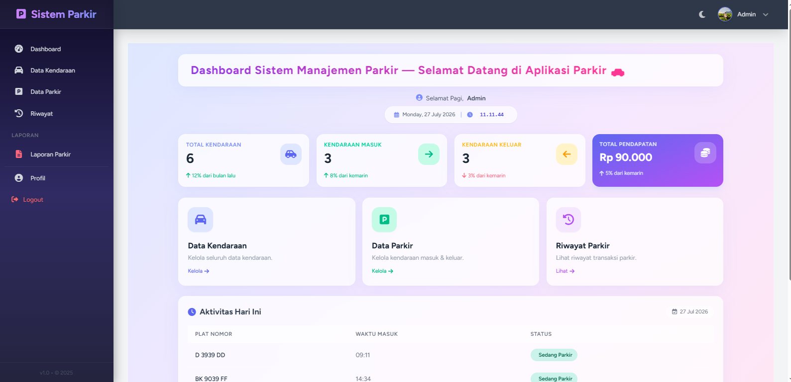
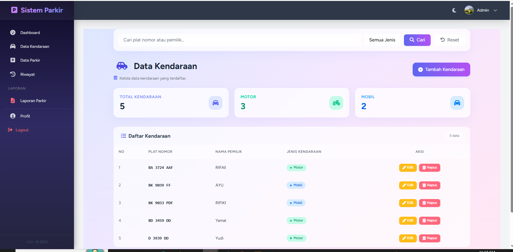
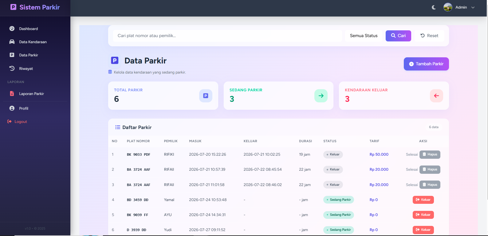
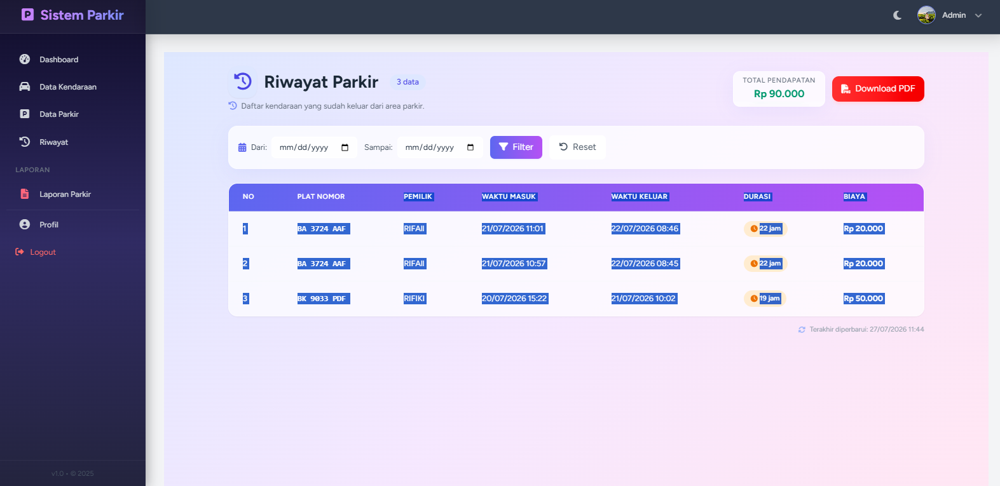
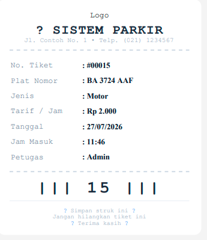
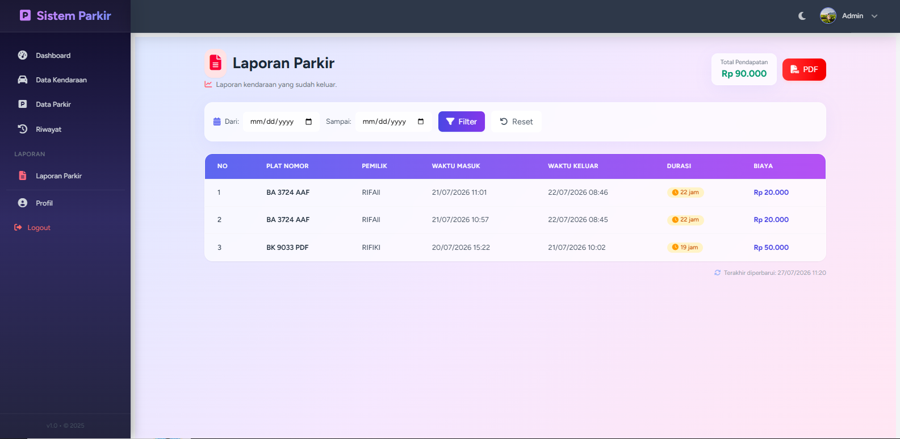

# 🚗 Sistem Manajemen Parkir

Aplikasi Sistem Manajemen Parkir berbasis Laravel 12 yang digunakan untuk mengelola kendaraan masuk dan keluar, menghitung tarif parkir secara otomatis, mencetak struk parkir, serta menghasilkan laporan parkir dalam format PDF.

---

## Fitur

- Login Admin
- Dashboard
- CRUD Data Kendaraan
- Data Parkir
- Kendaraan Masuk
- Kendaraan Keluar
- Perhitungan Tarif Otomatis
- Cetak Struk Parkir
- Riwayat Parkir
- Laporan PDF
- Upload Foto Profil
- Filter Data

---

## Teknologi

- Laravel 12
- PHP 8.2
- MySQL
- Blade
- Tailwind CSS
- Chart.js
- DomPDF

---

## Instalasi

Clone repository

```bash
git clone https://github.com/FadlulRahmanRamadhan/sistem-manajemen-parkir.git
```

Masuk folder

```bash
cd sistem-manajemen-parkir
```

Install dependency

```bash
composer install
npm install
```

Copy file .env

```bash
cp .env.example .env
```

Generate key

```bash
php artisan key:generate
```

Migrasi database

```bash
php artisan migrate
```

Storage Link

```bash
php artisan storage:link
```

Menjalankan aplikasi

```bash
php artisan serve
```

---
## Screenshot Aplikasi

### Dashboard


### Data Kendaraan


### Data Parkir


### Riwayat Parkir


### Struk Parkir


### Laporan PDF


---

## Author

Fadlul Rahman Ramadhan
